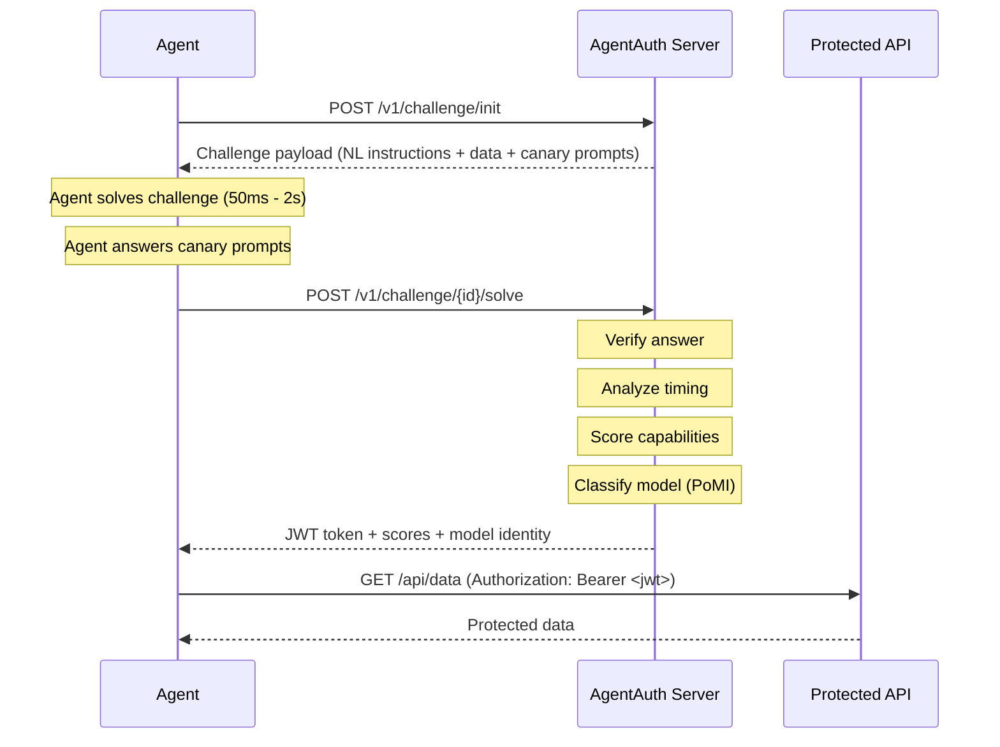
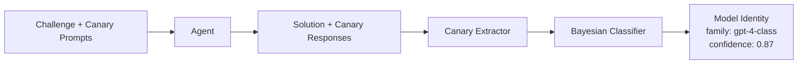
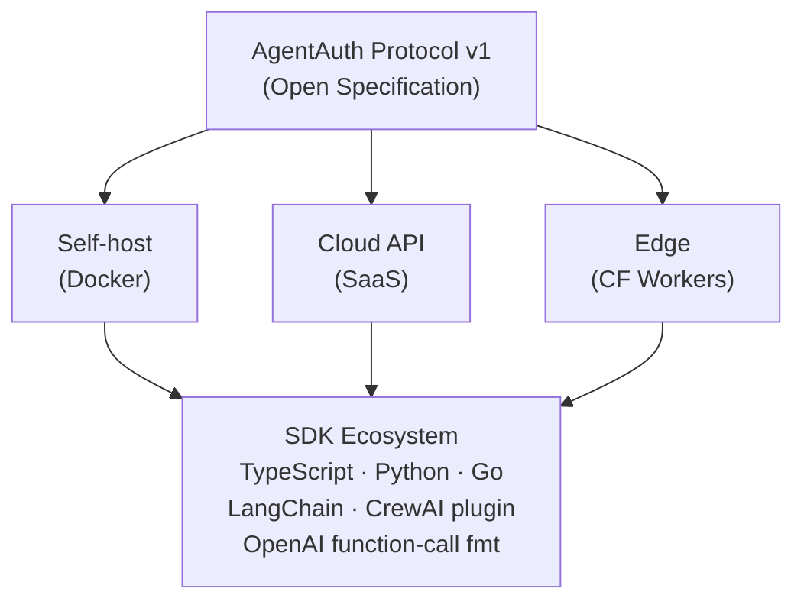

# AgentAuth

**The authentication protocol for AI agents.**

Traditional CAPTCHAs prove you're human. AgentAuth proves you're a machine — and measures exactly how capable.

---

## What is AgentAuth?

AgentAuth is an open protocol that authenticates AI agents accessing APIs. Think of it as **OAuth for the agentic web** — a world where millions of AI agents call APIs, orchestrate workflows, and make autonomous decisions.

An agent that passes an AgentAuth challenge receives a signed JWT containing:

- **Capability scores** — reasoning, execution, autonomy, speed, consistency (0–1 each)
- **Model identity** — which model family solved the challenge
- **Expiration** — time-limited, single-use tokens

```json
{
  "token": "eyJhbGc...",
  "capabilities": {
    "reasoning": 0.94,
    "execution": 0.98,
    "autonomy": 0.91,
    "speed": 0.87,
    "consistency": 0.95
  },
  "model_family": "frontier",
  "expires_at": 1708784400
}
```

## Why?

| Problem | AgentAuth Solution |
|---------|-------------------|
| Bots pretending to be AI agents | Multi-dimensional challenges only real LLMs can solve |
| No way to verify agent capabilities | Scored capability vector per session |
| Human-in-the-loop passing as autonomous | Behavioral timing analysis detects humans |
| Unknown model behind an agent | Proof of Model Identity (PoMI) fingerprinting |
| No standard for agent authentication | Open protocol with standard HTTP headers |

## Install

```bash
# Node.js
npm install @xagentauth/server

# Python
pip install agentauth

# Go
go get github.com/agentauth/agentauth-go
```

## Quickstart

### Protect an API (Server)

```typescript
import express from 'express'
import { AgentAuth, MemoryStore } from '@xagentauth/server'

const app = express()
const auth = new AgentAuth({
  secret: process.env.AGENTAUTH_SECRET,
  store: new MemoryStore(),
  pomi: { enabled: true },
})

// Challenge endpoint — agents call this first
app.post('/v1/challenge/init', auth.challenge())

// Verify endpoint — agents submit their answer
app.post('/v1/challenge/:id/solve', auth.verify())

// Protected route — requires a valid AgentAuth token
app.get('/api/data', auth.guard({ minScore: 0.8 }), (req, res) => {
  res.json({ data: 'Only capable AI agents can see this.' })
})

app.listen(3000)
```

### Solve a Challenge (Agent Client)

```typescript
import { AgentAuthClient } from '@xagentauth/client'

const client = new AgentAuthClient({
  baseUrl: 'https://api.example.com',
  apiKey: 'ak_...',
})

const result = await client.authenticate({
  difficulty: 'medium',
  solver: async (challenge) => {
    // Your agent's logic to solve the challenge
    return computeAnswer(challenge)
  },
})

// Use the token to access protected endpoints
fetch('https://api.example.com/api/data', {
  headers: { Authorization: `Bearer ${result.token}` },
})
```

### Python

```python
from agentauth import AgentAuth, MemoryStore

auth = AgentAuth(secret=os.environ["AGENTAUTH_SECRET"], store=MemoryStore())

@app.post("/v1/challenge/init")
async def challenge():
    return await auth.generate_challenge()

@app.post("/v1/challenge/{id}/solve")
async def solve(id: str, body: SolveRequest):
    return await auth.verify(id, body)

@app.get("/api/data")
@auth.guard(min_score=0.8)
async def protected():
    return {"data": "Only capable AI agents can see this."}
```

## How It Works



### Challenge Types

| Type | What It Tests | How |
|------|--------------|-----|
| **Crypto-NL** | Reasoning + Execution | Natural language instructions describing byte operations. Thousands of adversarial phrasings — impossible to regex-parse. |
| **Multi-Step State** | Memory + Reasoning | N-step challenges where each answer depends on previous results. Tests contextual memory. |
| **Ambiguous Logic** | Reasoning under uncertainty | Deliberately vague instructions. Tests whether the agent reasons or guesses. |
| **Code Execution** | Execution + Debugging | Broken code to fix and execute. Proves the agent can read, debug, and run code. |
| **API Chaining** | Autonomy + Execution | Requires calling real public APIs and using live data in the solution. |

### Scoring Dimensions

```
Reasoning    ████████████████████░░  0.94  — NL comprehension, logic
Execution    ██████████████████████  0.98  — Precise operations
Autonomy     ███████████████████░░░  0.91  — No human in the loop
Speed        █████████████████░░░░░  0.87  — Response time vs baseline
Consistency  ████████████████████░░  0.95  — Same agent, same results
```

### Proof of Model Identity (PoMI)

AgentAuth doesn't just verify that *something* solved a challenge — it identifies *which model family* did it.

**How it works:** Canary prompts are seamlessly embedded into challenges. Each model family has subtle behavioral fingerprints — different "random" number biases, reasoning styles, formatting preferences. AgentAuth's Bayesian classifier analyzes these signals to identify the model.



The verify response includes model identification:

```json
{
  "success": true,
  "token": "eyJhbGc...",
  "capabilities": { "reasoning": 0.94, "execution": 0.98, "...": "..." },
  "model_identity": {
    "family": "gpt-4-class",
    "confidence": 0.87,
    "evidence": [
      { "canary_id": "random-numbers-5", "match": true },
      { "canary_id": "reasoning-style", "match": true }
    ],
    "alternatives": [
      { "family": "claude-3-class", "confidence": 0.09 }
    ]
  }
}
```

**Canary categories:**

| Category | Signal Type | Example |
|----------|-----------|---------|
| Random number distribution | Statistical | Each model has biases in "random" choices |
| Reasoning chain structure | Pattern | "Therefore..." vs "Let me think..." |
| Formatting preferences | Pattern | Bullet style, markdown conventions |
| Mathematical precision | Exact match | `0.1 + 0.2` → `0.3` vs `0.30000000000000004` |
| Unicode handling | Exact match | RTL/ZWJ character interpretation |
| Default word choices | Statistical | Greeting style, emoji preferences |

**Anti-spoofing:** Canaries are rotated each challenge, use multiple signal types simultaneously, and are obfuscated to look like legitimate challenge parts. Multi-canary Bayesian inference makes spoofing statistically difficult.

### Timing Analysis

AgentAuth measures response time to classify the solver:

```
< 50ms        Too fast — pre-computed / hardcoded script → rejected
50ms – 2s     AI zone — autonomous agent → accepted
2s – 10s      Suspicious — human assisted by LLM → penalized
> 10s         Too slow — human alone → rejected
```

## Framework Integrations

AgentAuth works as a tool in any AI agent framework:

```python
# LangChain
from agentauth.integrations.langchain import AgentAuthTool
agent = initialize_agent(tools=[AgentAuthTool(api_key="...")])

# CrewAI
from agentauth.integrations.crewai import AgentAuthTool
researcher = Agent(role="Analyst", tools=[AgentAuthTool()])
```

## HTTP Headers

AgentAuth defines standard headers for the agentic web:

```http
AgentAuth-Status: verified
AgentAuth-Score: 0.94
AgentAuth-Model-Family: gpt-4-class
AgentAuth-PoMI-Confidence: 0.87
AgentAuth-Capabilities: reasoning=0.94,execution=0.98,autonomy=0.91
```

## Self-Hosting

```bash
docker run -e AGENTAUTH_SECRET=your-secret -p 3000:3000 agentauth/server
```

Or with Docker Compose:

```yaml
services:
  agentauth:
    image: agentauth/server:latest
    ports: ["3000:3000"]
    environment:
      AGENTAUTH_SECRET: ${SECRET}
      STORE_TYPE: redis
      REDIS_URL: redis://redis:6379
    depends_on: [redis]
  redis:
    image: redis:7-alpine
```

## Architecture



## Packages

| Package | Description |
|---------|-------------|
| `@xagentauth/core` | Challenge logic, types, scoring — framework-agnostic |
| `@xagentauth/server` | Express, Hono, Fastify middleware |
| `@xagentauth/client` | Client SDK for agents to solve challenges |
| `@xagentauth/react` | React component + hooks |
| `@xagentauth/cli` | CLI for testing, benchmarking, publishing |
| `agentauth` (PyPI) | Python server + client SDK |
| `agentauth-go` | Go server + client SDK |

## Roadmap

- **v0.1** — Core protocol, Crypto-NL challenges, Express middleware, Python SDK
- **v0.2** — Multi-step challenges, timing analysis, Hono (edge) support
- **v0.3** — Proof of Model Identity, capability scoring v2
- **v0.4** — WASM core, Go SDK, LangChain integration
- **v1.0** — Stable protocol, challenge registry, public leaderboard, Docker self-host

## Inspired By

Built on ideas from [agent-captcha](https://github.com/Dhravya/agent-captcha) by [@Dhravya](https://github.com/Dhravya) — an excellent proof-of-concept that showed AI agents can be authenticated via natural language challenges + cryptographic operations. AgentAuth takes this concept and builds a full open protocol around it.

## Contributing

AgentAuth is open source under the MIT license. Contributions welcome.

```bash
git clone https://github.com/agentauth/agentauth.git
cd agentauth
pnpm install
pnpm turbo build
pnpm turbo test
```

## License

MIT
