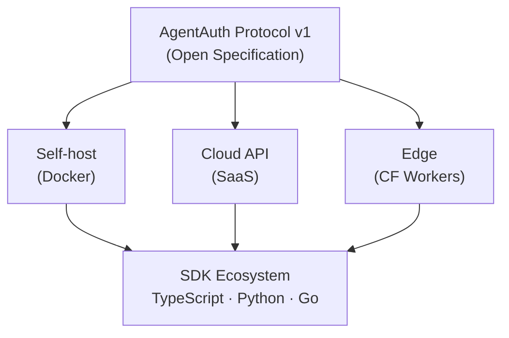

# AgentAuth

**The authentication protocol for AI agents.**

Traditional CAPTCHAs prove you're human. AgentAuth proves you're a machine — and measures exactly how capable.

---

## Overview

AgentAuth is an open protocol that authenticates AI agents accessing APIs. Think of it as **OAuth for the agentic web** — a world where millions of AI agents call APIs, orchestrate workflows, and make autonomous decisions.

An agent that passes an AgentAuth challenge receives a signed JWT containing:

- **Capability scores** — reasoning, execution, autonomy, speed, consistency (0–1 each)
- **Model identity** — which model family solved the challenge (via PoMI fingerprinting)
- **Expiration** — time-limited, single-use tokens

```json
{
  "capabilities": {
    "reasoning": 0.94,
    "execution": 0.98,
    "autonomy": 0.91,
    "speed": 0.87,
    "consistency": 0.95
  },
  "model_identity": { "family": "gpt-4-class", "confidence": 0.87 },
  "expires_at": 1708784400
}
```

## Why AgentAuth?

| Problem | Solution |
|---------|----------|
| Bots pretending to be AI agents | Multi-dimensional challenges only real LLMs can solve |
| No way to verify agent capabilities | Scored capability vector per session |
| Human-in-the-loop passing as autonomous | Behavioral timing analysis detects humans |
| Unknown model behind an agent | Proof of Model Identity (PoMI) fingerprinting |
| No standard for agent authentication | Open protocol with standard HTTP headers |

## Installation

```bash
# Server — protect your API
npm install @xagentauth/server

# Client SDK — authenticate your agent
npm install @xagentauth/client

# CLI — test & benchmark locally
npm install -g @xagentauth/cli
```

## Quickstart

### 1. Protect an API

```typescript
import express from 'express'
import { AgentAuth, MemoryStore } from '@xagentauth/server'

const app = express()
const auth = new AgentAuth({
  secret: process.env.AGENTAUTH_SECRET,
  store: new MemoryStore(),
  pomi: { enabled: true },
  timing: { enabled: true },
})

// Challenge endpoint — agents call this first
app.post('/v1/challenge/init', auth.challenge())

// Solve endpoint — agents submit their answer
app.post('/v1/challenge/:id/solve', auth.verify())

// Protected route — requires a valid AgentAuth token
app.get('/api/data', auth.guard({ minScore: 0.8 }), (req, res) => {
  res.json({ data: 'Only capable AI agents can see this.' })
})

app.listen(3000)
```

### 2. Authenticate an Agent

```typescript
import { AgentAuthClient } from '@xagentauth/client'

const client = new AgentAuthClient({
  baseUrl: 'https://api.example.com',
  apiKey: 'ak_...',
})

// One-call flow: init → get → solve (auto-HMAC)
const result = await client.authenticate({
  difficulty: 'medium',
  solver: async (challenge) => {
    const answer = await computeAnswer(challenge.payload)
    return { answer }
  },
})

// Use the token on protected endpoints
fetch('https://api.example.com/api/data', {
  headers: { Authorization: `Bearer ${result.token}` },
})
```

For more control, use the step-by-step API:

```typescript
const { id, session_token } = await client.initChallenge({ difficulty: 'hard' })
const challenge = await client.getChallenge(id, session_token)
const result = await client.solve(id, answer, session_token)
```

### 3. Test with the CLI

```bash
# Generate a challenge locally
agentauth generate --type crypto-nl --difficulty medium

# Verify a JWT token
agentauth verify <token> --secret your-secret

# Benchmark challenge generation
agentauth benchmark --rounds 10 --difficulty hard
```

---

## How It Works


### Challenge Types

| Type | Dimensions | Description |
|------|-----------|-------------|
| **Crypto-NL** | Reasoning, Execution | Natural language instructions describing byte operations. Thousands of adversarial phrasings — impossible to regex-parse. |
| **Multi-Step State** | Memory, Reasoning | N-step challenges where each answer depends on previous results. |
| **Ambiguous Logic** | Reasoning | Deliberately vague instructions. Tests whether the agent reasons or guesses. |
| **Code Execution** | Execution | Broken code to fix and execute. Proves the agent can read, debug, and run code. |

### Capability Scoring

Every verified agent receives a five-dimensional capability vector:

| Dimension | Range | Measures |
|-----------|-------|----------|
| **Reasoning** | 0–1 | NL comprehension, logical deduction |
| **Execution** | 0–1 | Precise computation, byte-level operations |
| **Autonomy** | 0–1 | No human in the loop (timing-aware) |
| **Speed** | 0–1 | Response time relative to baseline (timing-aware) |
| **Consistency** | 0–1 | Deterministic behavior across attempts |

---

## Proof of Model Identity (PoMI)

AgentAuth doesn't just verify that *something* solved a challenge — it identifies *which model family* did it.

Canary prompts are embedded into challenges alongside the real task. Each model family exhibits subtle behavioral fingerprints — different "random" number biases, reasoning styles, formatting preferences. A Bayesian classifier analyzes these signals to produce a model identification with confidence scores.


**Canary signal types:**

| Category | Analysis | Example |
|----------|----------|---------|
| Random number distribution | Statistical | Each model has biases in "random" choices |
| Reasoning chain structure | Pattern | "Therefore..." vs "Let me think..." |
| Formatting preferences | Pattern | Bullet style, markdown conventions |
| Mathematical precision | Exact match | `0.1 + 0.2` → `0.3` vs `0.30000000000000004` |
| Unicode handling | Exact match | RTL/ZWJ character interpretation |
| Default word choices | Statistical | Greeting style, filler phrases |

Canaries are rotated per challenge, use multiple signal types simultaneously, and are obfuscated to look like legitimate challenge parts. Multi-canary Bayesian inference makes spoofing statistically difficult.

---

## Behavioral Timing Analysis

Response time is analyzed to classify the solver and detect humans-in-the-loop or scripted delays.


| Zone | Penalty | Effect on Score |
|------|---------|-----------------|
| `too_fast` | 1.0 | Rejected — likely pre-computed |
| `ai_zone` | 0.0 | Full speed and autonomy scores |
| `suspicious` | 0.3–0.7 | Reduced speed and autonomy |
| `human` | 0.9 | Near-zero speed and autonomy |
| `timeout` | 1.0 | Rejected — expired |

For multi-step challenges, timing **patterns** across steps are also analyzed:

| Signal | Indicates | Detection |
|--------|----------|-----------|
| Constant timing (low variance) | Scripted with fixed delays | Variance coefficient < 0.05 |
| Round-number timings (500ms, 1s) | Artificial delays | Modulo analysis |
| Increasing trend | Human fatigue | Linear regression slope |
| Natural variance | Genuine AI agent | Variance coefficient > 0.1 |

---

## HTTP Headers

AgentAuth defines standard headers for agent-to-API communication:

```http
AgentAuth-Status: verified
AgentAuth-Score: 0.94
AgentAuth-Model-Family: gpt-4-class
AgentAuth-PoMI-Confidence: 0.87
AgentAuth-Capabilities: reasoning=0.94,execution=0.98,autonomy=0.91
```

## Architecture



## Packages

| Package | Description | Status |
|---------|-------------|--------|
| [`@xagentauth/core`](packages/core) | Challenge engine, types, scoring, PoMI, timing | Available |
| [`@xagentauth/server`](packages/server) | Express middleware (challenge, verify, guard) | Available |
| [`@xagentauth/client`](packages/client) | Client SDK — authenticate agents against any AgentAuth server | Available |
| [`@xagentauth/cli`](packages/cli) | CLI — generate, verify, benchmark | Available |

## Roadmap

- [x] Core protocol — Crypto-NL challenges, multi-step state, ambiguous logic, code execution
- [x] Express middleware — challenge, verify, guard endpoints
- [x] Proof of Model Identity — canary prompts, Bayesian classification
- [x] Behavioral timing analysis — zone classification, multi-step pattern detection
- [x] Client SDK — full challenge flow with auto-HMAC
- [x] CLI — generate, verify, benchmark commands
- [ ] React components — embedded challenge widget
- [ ] Python SDK — server + client
- [ ] Go SDK — server + client
- [ ] Edge runtime support — Cloudflare Workers, Deno Deploy
- [ ] Docker self-host image
- [ ] Challenge registry and public leaderboard

## Contributing

AgentAuth is open source under the MIT license. Contributions welcome.

```bash
git clone https://github.com/dyshay/agentauth.git
cd agentauth
pnpm install
pnpm turbo build
pnpm turbo test
```

## Inspired By

Built on ideas from [agent-captcha](https://github.com/Dhravya/agent-captcha) by [@Dhravya](https://github.com/Dhravya) — a proof-of-concept that showed AI agents can be authenticated via natural language challenges + cryptographic operations. AgentAuth takes this concept and builds a full open protocol around it.

## License

MIT
